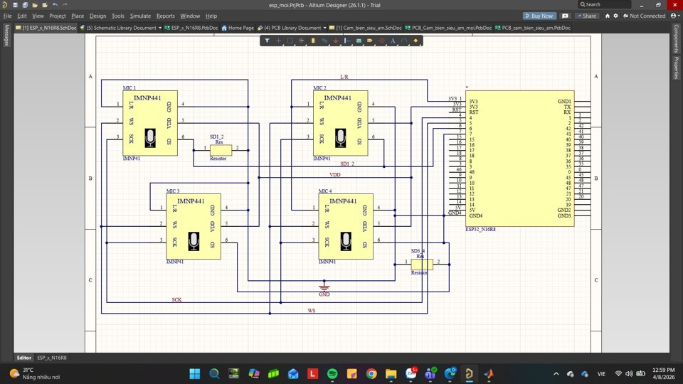
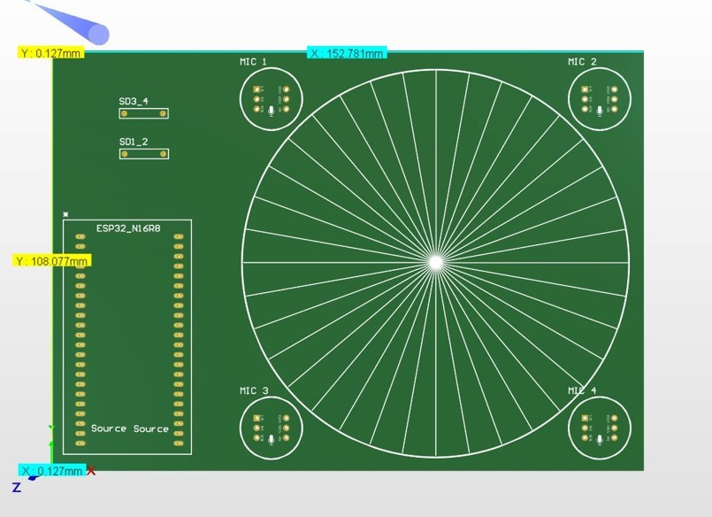
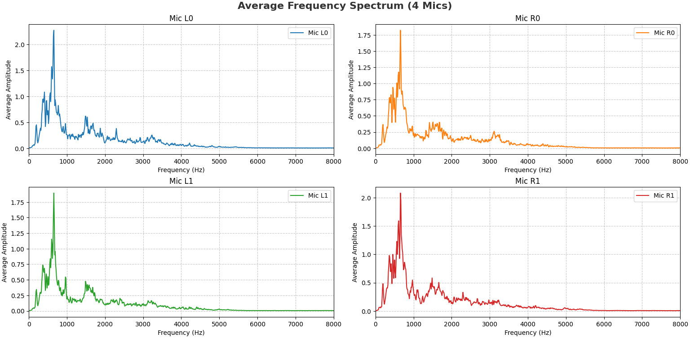

# ESP32-S3 Multi-Source DOA Estimation

**360° sound direction estimation with four INMP441 microphones, GCC-PHAT accumulation, and SRP-PHAT spatial scanning.**

[Tiếng Việt](README.vi.md) · [Technical notes](docs/TECHNICAL_NOTES.md) · [Report figures](docs/FIGURES.md)

An embedded acoustics project by **Le Dang Cong Vinh**, Hanoi University of Science and Technology, supervised by **Assoc. Prof. Nguyen Quoc Cuong**. The system estimates the **azimuth** of sound sources locally on an ESP32-S3 and prints detections over serial. Python tools support offline analysis and room simulation.

<p align="center"></p>

## What the project does

- Acquires four microphone channels at **48 kHz** using two I2S peripherals sharing a clock.
- Separates acquisition and DSP into FreeRTOS tasks on the two CPU cores.
- Computes GCC-PHAT for all **six microphone pairs**, accumulates **23 active frames**, and scans a **360-point azimuth grid**.
- Selects up to **three candidate sound directions**, suppressing a ±25° neighborhood after each selected peak.
- Uses external PSRAM for history/accumulation buffers and internal SRAM for FFT buffers.
- Provides Python plots of direction versus time, polar response, microphone spectra, and pairwise correlation.

This is a research prototype. A 1° scan step is **not** a measured 1° accuracy guarantee. The output is a direction, not source distance, 3D position, separated audio, or persistent speaker identity.

## Repository map

| File | Purpose |
| --- | --- |
| [`src/main.cpp`](src/main.cpp) | Embedded acquisition, filtering, GCC/SRP processing, peak selection, and serial output |
| [`src/srp_lut.h`](src/srp_lut.h) | Six-pair, 360-angle delay lookup table used by the firmware |
| [`platformio.ini`](platformio.ini) | ESP32-S3 DevKitC-1, Arduino, OPI PSRAM, 256000-baud monitor |
| [`generate_lut.py`](generate_lut.py) | Generates `src/srp_lut.h` from array geometry |
| [`srp_lut.h`](srp_lut.h) | Matching LUT copy loaded by the offline Python script |
| [`sound_processing.py`](sound_processing.py) | Analysis and plotting of an existing four-channel WAV |
| [`record_dataset.py`](record_dataset.py) | Serial recording client; needs separate recording firmware, which is **not included** |
| [`soundtest.py`](soundtest.py) | Experimental room simulation; see the setup caveat below |
| [`docs/`](docs/) | Figures, provenance, implementation differences, and verification notes |

The original firmware and Python scripts are preserved. Build caches, IDE files, and temporary data are excluded. Raw recordings, editable Altium PCB/schematic files, and recording firmware were not present in the supplied project folder.

## Hardware and wiring

Use an **ESP32-S3 board with working OPI PSRAM** matching the `qio_opi` configuration, four INMP441 microphones, a stable 3.3 V supply/common ground, and a USB data connection. The source configuration targets an R8-style PSRAM setup; check the actual module variant before flashing.

| Signal | ESP32-S3 GPIO | Connection |
| --- | --- | --- |
| BCLK / SCK | 4 | Shared clock for all microphones |
| WS / LRCLK | 5 | Shared word-select for all microphones |
| SD, pair 0 | 6 | L0 and R0 share the first data line |
| SD, pair 1 | 7 | L1 and R1 share the second data line |
| VDD / GND | 3.3 V / GND | Common power and ground |

The firmware's channel convention is:

| Microphone | Model angle | Model position (m) | I2S slot | WAV column |
| --- | --- | --- | --- | --- |
| L0 | 0° | (+0.06, 0) | I2S0 Left | 0 |
| R0 | 90° | (0, +0.06) | I2S0 Right | 1 |
| R1 | 180° | (-0.06, 0) | I2S1 Right | 3 |
| L1 | 270° | (0, -0.06) | I2S1 Left | 2 |

Set each microphone's L/R selection for its intended slot (Left to ground, Right to 3.3 V). Verify the actual channel assignment with a known source before interpreting angles. The mathematical LUT uses a **6 cm center-to-microphone radius** and sound speed **343 m/s**. The report's board photo is a physical reference; the table above defines the coordinate model in code. Measure your assembled geometry and regenerate the LUT if it differs.

<details>
<summary>Schematic and PCB images from the report</summary>





These are report illustrations, not editable fabrication files.
</details>

## How the algorithm works


1. **Acquire and align:** I2S0 drives BCLK/WS; I2S1 uses those signals through the GPIO matrix. The slave starts before the master. Core 0 reads 512-sample chunks and queues pointers.
2. **Preprocess:** Convert the 24-bit microphone payload from 32-bit slots to normalized floats and apply a biquad high-pass filter.
3. **Frame and gate:** Use 4096-sample frames, a 2048-sample hop, RMS activity gating, and a Hamming window. Skip 15 warm-up frames.
4. **Correlate:** FFT each channel, normalize each pair's cross-spectrum with PHAT weighting, retain selected frequency bins, and transform to a lag response.
5. **Accumulate and scan:** Accumulate 23 frames that pass the gate. Interpolate the lag response at the six LUT delays for every angle and sum the pair scores.
6. **Select directions:** Repeatedly select the strongest peak above threshold and suppress ±25° around it, stopping after three peaks or when no qualifying peak remains.

The embedded and offline implementations deliberately use a **forward FFT** for the correlation transform with their LUT sign convention. The report calls this stage IFFT; see [technical notes](docs/TECHNICAL_NOTES.md) before changing signs or transforms.

| Parameter | Firmware value |
| --- | --- |
| Sample rate | 48000 Hz |
| Frame / FFT / hop | 4096 / 4096 / 2048 samples |
| Analysis window / hop time | 85.33 ms / 42.67 ms |
| Accumulation | 23 active frames |
| RMS gate | `9500.0 / 8388608.0` ≈ 0.00113 |
| PHAT bins | 25–400, approximately 293–4688 Hz |
| SRP peak threshold | 1.25 |
| Peak suppression / source limit | ±25° / 3 |
| Serial monitor | 256000 baud |

The nominal accumulation cadence is about **0.98 s of active-frame hops**. Silence does not reset the accumulation, so elapsed wall time can be longer. Serial timestamps are derived from processed frames rather than a hardware wall clock.

## Build and run the ESP32-S3 firmware

Install PlatformIO Core, or use the PlatformIO extension in VS Code. Run commands from the repository root:

```sh
git clone https://github.com/Congvinh167/DOA-Estimation.git
cd DOA-Estimation
pio run
pio run --target upload
pio device monitor --baud 256000
```

If port detection fails, select the correct port explicitly, for example `pio run --target upload --upload-port COM7` and `pio device monitor --port COM7 --baud 256000`. Close other serial tools before opening the port. Uploading replaces the firmware on the connected board.

**Verified build environment:** PlatformIO Core 6.1.19, Espressif32 platform 6.9.0, Arduino-ESP32 2.0.17 (package 3.20017.0), target `esp32-s3-devkitc-1`. That Arduino package contains the ESP-DSP headers/library needed by this source. `platformio.ini` retains the original unpinned platform setting; to reproduce the checked environment, change it locally to `platform = espressif32@6.9.0`.

The code uses the legacy `driver/i2s.h` API and chip-specific GPIO routing. A newer Arduino/ESP-IDF stack may require porting. Do not add an arbitrary second ESP-DSP library if the framework already supplies it.

After startup, the serial monitor should show:

```text
SRP-PHAT Multi-DOA Accumulator initialized successfully.
```

During qualified detections it prints `Nguồn ...: Góc ...° (Năng lượng: ...)`. These mean source candidate, estimated angle, and normalized SRP score. The score is not a calibrated sound-pressure level. Source numbering is reassigned per output window.

## Python setup and offline analysis

Create a Python environment (Python 3.11 is a reasonable starting point; see verification notes):

```sh
python -m venv .venv
```

Windows PowerShell:

```powershell
.\.venv\Scripts\Activate.ps1
python -m pip install -r requirements.txt
```

Linux/macOS activation is `source .venv/bin/activate`.

### Analyze an existing recording

`sound_processing.py` expects **48 kHz, four-channel float32 WAV**, with columns **L0, R0, L1, R1** and normalized sample amplitudes. It does not normalize integer PCM, resample audio, or apply the firmware's high-pass filter. Supply correctly prepared data; a sample-rate warning alone does not make another rate valid.

1. Put your recording in the repository root as `record3.wav`, or change the `filename` variable in the script.
2. Keep the root `srp_lut.h` beside the script.
3. Run:

```sh
python sound_processing.py
```

The script prints detections and opens Matplotlib figures. It uses a **1.15** peak threshold and **25–390** frequency bins, so its results need not match the firmware exactly. No example recording is bundled.

### Regenerate the delay table

Edit `FS`, `V`, and `R` in `generate_lut.py` when your sampling rate, sound speed, or radius changes. The generator assumes the four fixed cardinal positions; other geometries require modifying its coordinate equations.

```sh
python generate_lut.py
```

It writes **only** `src/srp_lut.h`. Synchronize the offline copy afterward:

```powershell
Copy-Item src/srp_lut.h srp_lut.h
```

On Linux/macOS use `cp src/srp_lut.h srp_lut.h`. Run the generator from the repository root. The published LUT copies are identical.

### Recording client: separate firmware required

`record_dataset.py` is a client for a **different recording firmware**, absent from this repository. The included DOA firmware prints text and does **not** implement this protocol. Running the client against it will wait indefinitely.

The client defaults to `COM7`, **921600 baud**, nine seconds, four channels, and float32 samples. It sends `START\n`, waits for `RECORDING_DONE` and `SYNC_START`, then reads **6,912,000 bytes**. Only use it after providing firmware with that protocol and matching channel order. Change `COM_PORT` as needed. The current receive loops have no overall timeout; stop the program if the device does not respond.

### Experimental room simulation

`soundtest.py` uses `pyroomacoustics`; install `requirements-simulation.txt` separately. It may require a native compiler if no wheel is available.

```sh
python -m pip install -r requirements-simulation.txt
```

**Before running:** the original script sets `rt_60 = 0.0` and then calls `pra.inverse_sabine(...)`, which can fail before its later anechoic override. For an anechoic run, skip that inverse-Sabine call and directly use `e_absorption, max_order = 1.0, 0`. Then run `python soundtest.py`.

This exploratory script uses separate thresholds and channel indexing. Its directional fan-noise source is still active despite a later “disabled” comment; its final sensor SNR setting is 100 dB. It is not a matched reproduction of the firmware or the report experiment.

## Results documented in the report


The report describes examples with two sources around **3° and 177°** (SRP scores **1.74 and 1.20**) and three sources at **0°, 180°, and 103°** (scores **1.42, 1.27, and 1.16**). These are **reported observations**, not measurements newly reproduced for this publication. The displayed plot is Figure 4.2 from the report; its original title uses “Simulation.”

The firmware's current 1.25 threshold would reject scores 1.20 and 1.16. Therefore those report examples must not be represented as guaranteed outputs of the exact published configuration. The report does not provide a dataset with ground truth and aggregate error statistics sufficient to establish accuracy across rooms, source distances, or noise conditions.

<details>
<summary>Four-channel frequency spectrum</summary>


</details>

## Troubleshooting and limitations

| Symptom | Check |
| --- | --- |
| Boot crash or invalid buffers | Correct board/OPI PSRAM configuration; the firmware does not check every allocation result |
| No detections | Wiring, slot selection, actual input level, RMS/SRP thresholds, and 23 qualifying frames |
| Rotated or mirrored angles | Physical microphone order, LUT geometry, channel indexing, and transform sign convention |
| Python cannot find WAV/LUT | Run from the repository root and supply the expected input files |
| Recording client hangs | Its separate recording firmware and protocol are required |
| `inverse_sabine` fails | Apply the anechoic setup correction described above |
| Differences between Python and ESP32 | Threshold, frequency mask, filtering, warm-up, and remainder handling differ |

Closely spaced sources may fall inside the same suppression region. Reverberation, correlated sources, array geometry errors, and channel misalignment can degrade estimates. Queue/backpressure behavior and allocation failures need more instrumentation before unattended use. See [technical notes](docs/TECHNICAL_NOTES.md).

## Verification and future work

The publication checks include a successful firmware build, Python syntax checks, LUT consistency, and document/figure review. No physical board was flashed or tested for this publication, and the original recording dataset is unavailable. See [verification details](docs/TECHNICAL_NOTES.md#publication-checks).

Useful next work includes a reproducible labeled dataset, matched Python/firmware parameters, recording firmware with timeouts, measured angular error and processing latency, queue/drop diagnostics, and evaluation in reverberant rooms. The original report also proposes learning-based localization as a future direction.

## Credits and reuse

Based on *Design of a Microphone Array for Multi Sound Source Localization*, Project I report, HUST, 2026. Author: Le Dang Cong Vinh. Supervisor: Assoc. Prof. Nguyen Quoc Cuong. Report figure references are listed in [docs/FIGURES.md](docs/FIGURES.md).

No open-source license was supplied with the original project, and none is added here. Contact the author about reuse or redistribution; third-party components retain their respective licenses.
