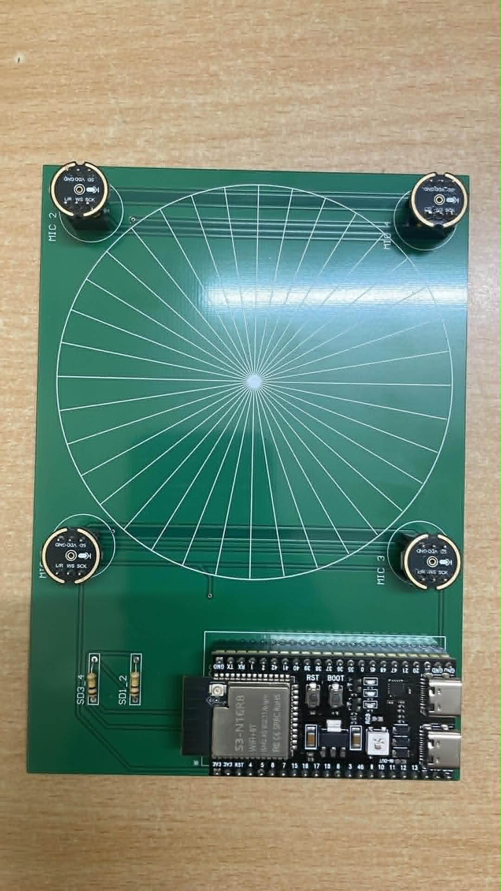
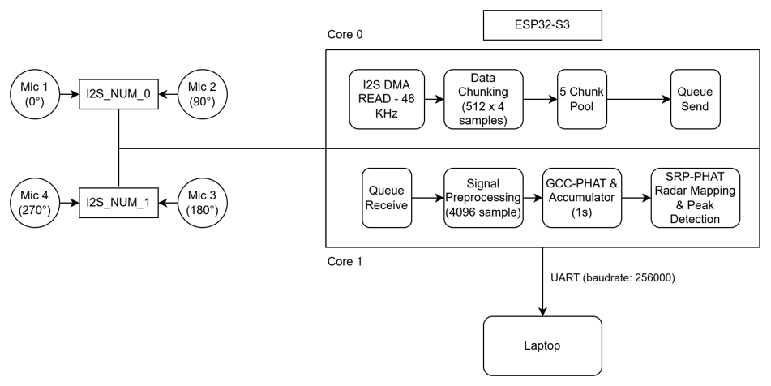
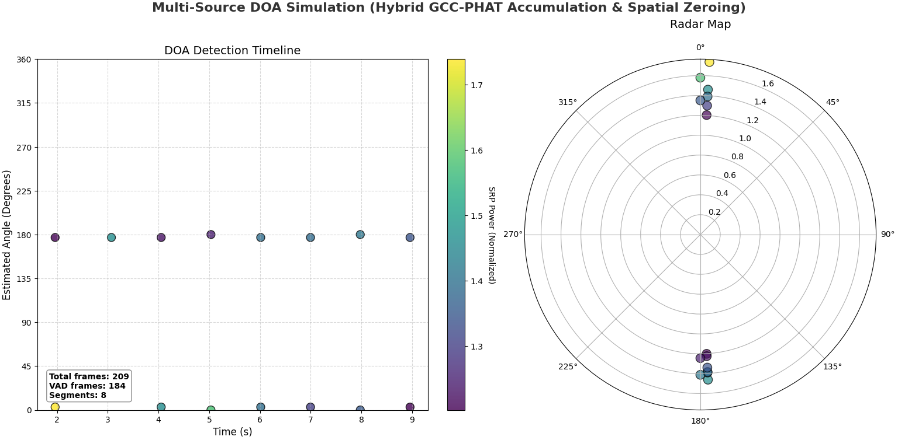

# Ước lượng hướng âm đa nguồn bằng ESP32-S3

[English README](README.md) · [Ghi chú kỹ thuật](docs/TECHNICAL_NOTES.md) · [Nguồn ảnh](docs/FIGURES.md)

Dự án dùng **ESP32-S3 và 4 micro INMP441** để ước lượng góc phương vị của nguồn âm trong phạm vi 360°. Thuật toán kết hợp **GCC-PHAT**, tích lũy tương quan theo thời gian, **SRP-PHAT** và loại vùng lân cận đỉnh để chọn tối đa ba hướng âm trong mỗi lần xử lý.

**Tác giả:** Lê Đăng Công Vinh, Đại học Bách khoa Hà Nội. **Giảng viên hướng dẫn:** PGS. Nguyễn Quốc Cường. Dự án thuộc Đồ án I, năm 2026.

<p align="center"></p>

## Tổng quan

Core 0 thu bốn kênh âm thanh qua hai bộ I2S dùng chung clock. Core 1 lọc tín hiệu, chia khung, tính tương quan sáu cặp micro và quét góc. Kết quả được in qua Serial; Python hỗ trợ phân tích WAV và vẽ biểu đồ.



| Thông số firmware | Giá trị |
| --- | --- |
| Tần số lấy mẫu | 48 kHz |
| Kích thước khung / FFT | 4096 mẫu |
| Bước dịch | 2048 mẫu, chồng lấn 50% |
| Tích lũy | 23 khung vượt ngưỡng năng lượng |
| Mô hình hình học | 4 vị trí 0°, 90°, 180°, 270°, bán kính 6 cm |
| Lưới quét | 0–359°, bước 1° |
| Ngưỡng SRP | 1,25 |
| Loại vùng quanh đỉnh | ±25° |
| Số hướng tối đa | 3 |
| Serial Monitor | 256000 baud |

Bước quét 1° không đồng nghĩa sai số thực nghiệm 1°. Hệ thống xác định **hướng**, chưa xác định khoảng cách, tọa độ 3D hoặc danh tính người nói. Việc tích lũy chỉ đếm các khung có tín hiệu nên khoảng cách giữa hai lần xuất kết quả có thể dài hơn một giây.

## Cấu trúc mã nguồn

| Tệp | Chức năng |
| --- | --- |
| `src/main.cpp` | Firmware thu I2S, xử lý DSP và xuất góc |
| `src/srp_lut.h` | Bảng trễ cho firmware |
| `generate_lut.py` | Tạo bảng trễ theo hình học mảng micro |
| `srp_lut.h` | Bản LUT dùng cho Python |
| `sound_processing.py` | Phân tích WAV bốn kênh và vẽ kết quả |
| `record_dataset.py` | Client thu dữ liệu qua Serial, cần firmware thu riêng |
| `soundtest.py` | Mô phỏng phòng âm học thử nghiệm |
| `platformio.ini` | Cấu hình board và biên dịch |
| `docs/` | Ghi chú kỹ thuật và ảnh từ báo cáo |

Mã gốc được giữ nguyên. Không đưa cache build hoặc cấu hình IDE cá nhân lên kho.

## Phần cứng và nối dây

Cần ESP32-S3 có **OPI PSRAM** phù hợp cấu hình `qio_opi`, bốn INMP441, nguồn 3,3 V và mass chung.

| Tín hiệu | GPIO |
| --- | --- |
| BCLK/SCK chung | 4 |
| WS/LRCLK chung | 5 |
| SD cặp L0/R0 | 6 |
| SD cặp L1/R1 | 7 |

Theo mô hình trong code: **L0 = 0°, R0 = 90°, R1 = 180°, L1 = 270°**. Thứ tự cột WAV là **L0, R0, L1, R1**, không phải thứ tự tăng dần của góc. Chân L/R chọn kênh trái nối GND, kênh phải nối 3,3 V; cần kiểm tra thực tế từng kênh với nguồn âm đã biết.

Ảnh PCB trong báo cáo là tài liệu tham khảo. Hãy đo vị trí micro thực tế và đối chiếu mô hình bán kính 6 cm của LUT trước khi đánh giá góc. Xem [sơ đồ nguyên lý](docs/images/schematic.jpg) và [PCB](docs/images/pcb-layout.jpg).

## Biên dịch và chạy

Cài PlatformIO Core hoặc extension PlatformIO trong VS Code, sau đó chạy tại thư mục gốc:

```sh
git clone https://github.com/Congvinh167/DOA-Estimation.git
cd DOA-Estimation
pio run
pio run --target upload
pio device monitor --baud 256000
```

Nếu cần, thêm `--upload-port COM7` cho lệnh upload hoặc `--port COM7` cho Serial Monitor; thay COM7 bằng cổng thực tế. Upload sẽ thay firmware đang có trên board.

Đã biên dịch thành công với **PlatformIO 6.1.19, Espressif32 6.9.0, Arduino-ESP32 2.0.17**. `platformio.ini` vẫn giữ cấu hình gốc chưa khóa phiên bản; muốn dùng đúng môi trường đã kiểm tra, đổi thành `platform = espressif32@6.9.0`. Firmware dùng API I2S cũ, nên bản framework mới hơn có thể cần điều chỉnh.

Serial in thông báo khởi tạo rồi xuất `Nguồn ...: Góc ...° (Năng lượng: ...)` khi có đỉnh đủ điều kiện. “Năng lượng” là điểm SRP chuẩn hóa, không phải mức áp suất âm. Số thứ tự nguồn không duy trì danh tính giữa các lần xuất.

## Chạy Python

Ví dụ trên Windows PowerShell:

```powershell
python -m venv .venv
.\.venv\Scripts\Activate.ps1
python -m pip install -r requirements.txt
```

Để phân tích, chuẩn bị WAV **48 kHz, 4 kênh float32 đã chuẩn hóa**, thứ tự **L0, R0, L1, R1**. Đặt tên `record3.wav` ở thư mục gốc hoặc sửa biến `filename`, rồi chạy:

```sh
python sound_processing.py
```

Script không tự chuẩn hóa PCM số nguyên, đổi tần số lấy mẫu hoặc lọc thông cao như firmware. Kho chưa có WAV mẫu. Ngưỡng của script là **1,15**, dải bin **25–390**, khác firmware **1,25** và **25–400**.

Khi đổi hình học, sửa `FS`, `V`, `R` trong generator và chạy:

```powershell
python generate_lut.py
Copy-Item src/srp_lut.h srp_lut.h
```

Generator chỉ tự ghi `src/srp_lut.h`; lệnh copy đồng bộ bản Python. Với hình học khác bốn vị trí vuông góc, cần sửa cả phương trình tọa độ.

**Thu dữ liệu:** `record_dataset.py` mặc định COM7, 921600 baud, thu 9 giây. Nó gửi `START`, chờ `RECORDING_DONE`, `SYNC_START`, rồi nhận 6.912.000 byte float32. Firmware `src/main.cpp` hiện tại **không có giao thức này**, nên không thể dùng trực tiếp để thu WAV; chương trình sẽ chờ. Firmware thu riêng chưa có trong nguồn được cung cấp.

**Mô phỏng:** cài `python -m pip install -r requirements-simulation.txt`. Trước khi chạy `soundtest.py`, bỏ lời gọi `pra.inverse_sabine` với `rt_60 = 0.0` và dùng trực tiếp `e_absorption, max_order = 1.0, 0` nếu muốn mô phỏng không dội âm. Mã thử nghiệm gốc vẫn được giữ nguyên và chưa được xác nhận chạy trọn vẹn. Các thiết lập của nó khác firmware.

## Kết quả và giới hạn



Báo cáo mô tả trường hợp hai nguồn tại khoảng **3° và 177°**, và ba nguồn tại **0°, 180°, 103°**. Đây là số liệu được báo cáo, chưa được đo lại trong lần công bố này. Một số điểm SRP trong báo cáo thấp hơn ngưỡng firmware hiện tại; vì vậy không thể khẳng định bản mã này sẽ tái tạo đúng các kết quả ấy.

Chưa có bộ dữ liệu kèm nhãn góc chuẩn để tính sai số tổng hợp. Các yếu tố như tiếng vang, sai lệch hình học, sai thứ tự kênh và hai nguồn ở gần nhau có thể ảnh hưởng kết quả. Firmware còn cần bổ sung kiểm tra cấp phát bộ nhớ, đếm mất mẫu và kiểm tra quyền sử dụng buffer khi xử lý bị chậm.

Đã kiểm tra build firmware, cú pháp Python, tính nhất quán LUT và đường dẫn tài liệu. Chưa nạp board hay kiểm nghiệm âm thanh thực tế. Kho chưa có firmware thu WAV, dữ liệu ghi âm hoặc file Altium/Gerber chỉnh sửa được. Chi tiết nằm trong [ghi chú kỹ thuật](docs/TECHNICAL_NOTES.md).

Hướng phát triển: bổ sung dữ liệu đo có góc chuẩn, đồng bộ cấu hình Python/ESP32, hoàn thiện chế độ thu âm, đo độ trễ và sai số trong nhiều phòng; báo cáo cũng đề xuất hướng định vị bằng học sâu.

## Nguồn và quyền sử dụng

Ảnh trích từ báo cáo *Design of a Microphone Array for Multi Sound Source Localization*, Đồ án I, năm 2026. Danh sách hình và số trang ở [docs/FIGURES.md](docs/FIGURES.md).

Dự án gốc chưa kèm giấy phép mã nguồn mở; bản công bố này không tự bổ sung giấy phép. Liên hệ tác giả khi cần sử dụng hoặc phân phối lại. Các thư viện bên thứ ba giữ giấy phép riêng.
